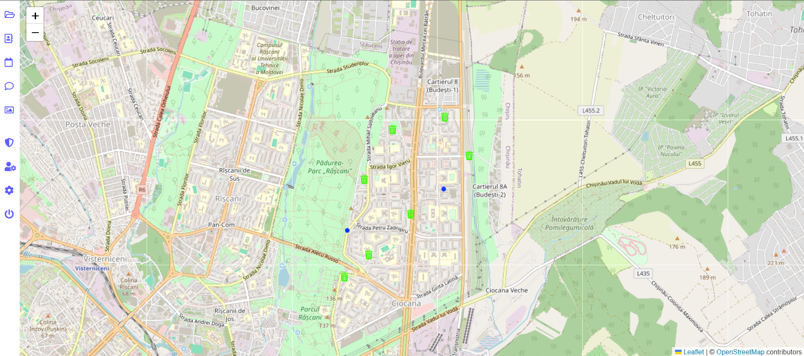

# Greenguard

## Smart Waste Collection Prototype Built with Vue.js

**Greenguard** is a prototype application developed with **Vue.js**, designed to simulate the tracking of garbage trucks collecting waste bins throughout a city.

The goal of the full application is to include features such as:
- **Bin fill-level sensors**
- **Real-time GPS tracking of vehicles**
- **Intelligent route optimization** to reduce fuel usage and improve efficiency

Currently, truck movement is **simulated** for demonstration purposes. However, this concept could be scaled and proposed at the **municipal level** to modernize urban waste collection systems.

---

## 🔐 Registration Page

## 🗺️ Interactive Map

---

## 🔗 Live Demo

[Try the prototype here](https://green-guard-eight.vercel.app/)